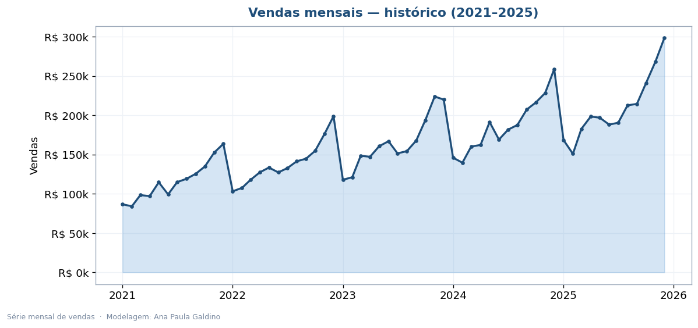
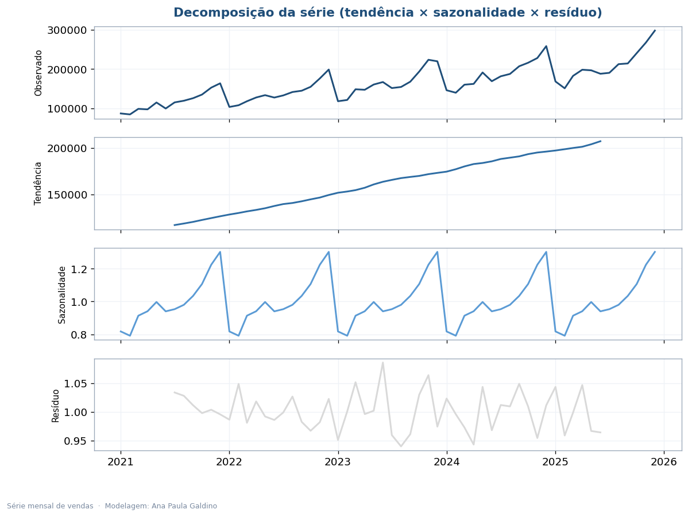
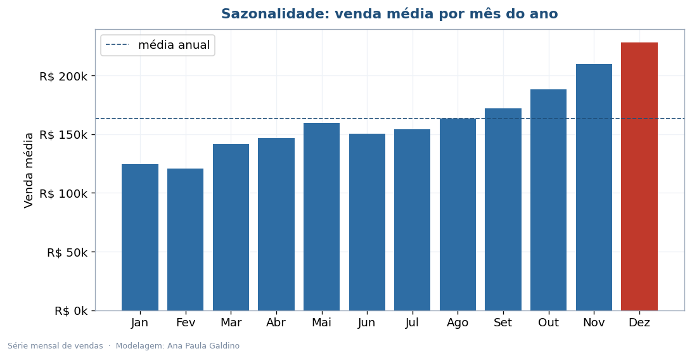
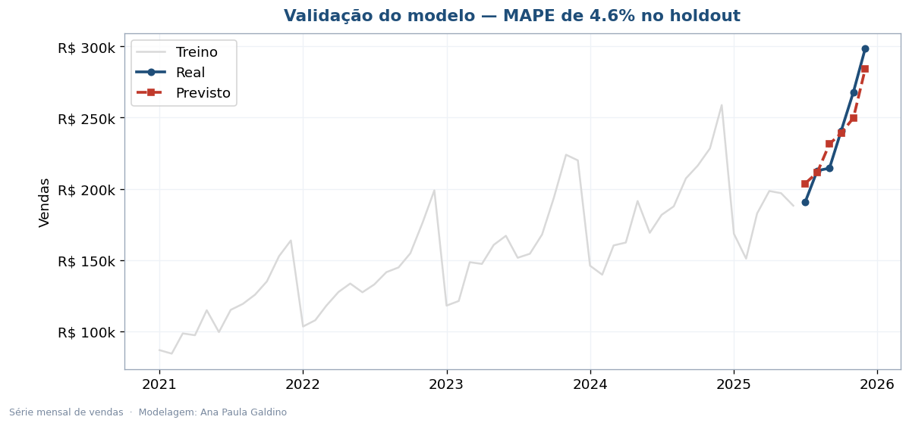
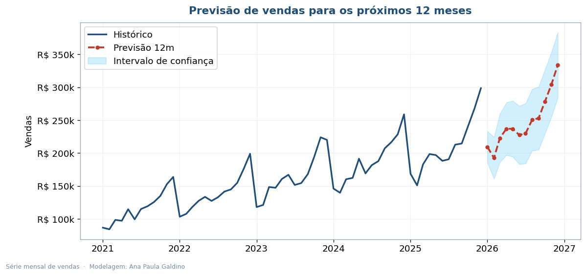
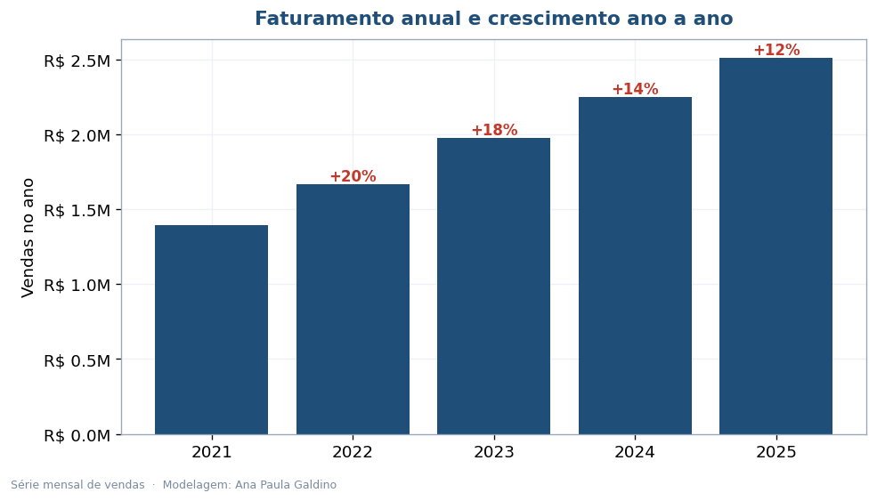

# Previsão de Vendas com Séries Temporais

Quanto vamos vender nos próximos 12 meses? Esta é a pergunta que todo planejamento começa
respondendo. Aqui eu pego 5 anos de vendas mensais, entendo o comportamento da série e treino
um modelo de séries temporais (SARIMAX) que projeta o futuro com intervalo de confiança — e,
mais importante, com o erro medido.

**[Ler o relatório executivo (PDF)](Analise_Executiva_Previsao_Vendas.pdf)**

## O caminho

1. **Entender** a série: tendência, sazonalidade e ruído (decomposição).
2. **Validar** o modelo num período que ele nunca viu (holdout) e medir o erro (MAPE).
3. **Projetar** os próximos 12 meses com intervalo de confiança.

## O que saiu

| Indicador | Resultado |
|---|---|
| Erro de previsão (MAPE no holdout) | **4,6%** |
| Receita prevista (próximos 12 meses) | ~R$ 3,0 milhões |
| Crescimento projetado vs. último ano | +18% |
| Pico sazonal | novembro e dezembro |

Um MAPE de 4,6% quer dizer que, num mês que o modelo nunca tinha visto, ele errou em média
menos de 5% — precisão de sobra para planejar estoque, equipe e caixa.

## As visualizações

| | |
|---|---|
|  |  |
|  |  |
|  |  |

## Tecnologias

Python 3.10+, pandas, statsmodels (SARIMAX e decomposição), matplotlib e reportlab.

## Organização

```
previsao-vendas-series-temporais/
├── README.md
├── Analise_Executiva_Previsao_Vendas.pdf
├── requirements.txt
├── dados/vendas_mensais.csv
├── src/
│   ├── gerar_dados.py        # monta a série mensal
│   ├── previsao_vendas.py    # decompõe, valida e projeta (gera os 6 gráficos)
│   └── gerar_relatorio.py    # monta o PDF
└── imagens/
```

```bash
pip install -r requirements.txt
python src/gerar_dados.py
python src/previsao_vendas.py
python src/gerar_relatorio.py
```

## Sobre os dados

A série (60 meses) foi construída por mim com tendência, sazonalidade e ruído realistas, para
o projeto rodar do início ao fim sem depender de dados externos. Para usar vendas reais, basta
substituir o CSV mantendo as colunas `mes` e `vendas`.

---

Ana Paula Galdino · Data Analytics (POSTECH/FIAP)
[GitHub](https://github.com/AnaPaula-Galdino) · [LinkedIn](https://linkedin.com/in/galdinoana/)
